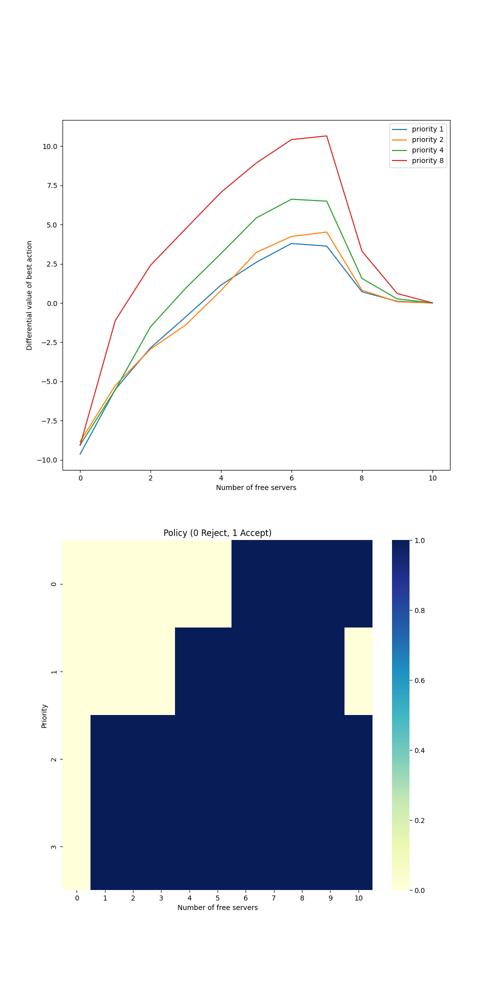

# Access-Control Queuing Task – Differential Semi-gradient SARSA

## Overview

This notebook implements **Differential Semi-gradient SARSA** on the **Access-Control Queuing Task**, following the example in **Sutton & Barto, *Reinforcement Learning: An Introduction* (2nd Edition), Chapter 10**.

The task involves managing a queue of customers with varying priorities competing for access to a fixed number of servers. The agent must learn an optimal acceptance policy that maximizes **average reward** over time without discounting.

---

## Environment and Problem Setup

### Task Description

* There are **10 servers** that can each handle one customer at a time.
* Customers arrive with **one of 4 priorities** (0–3), corresponding to rewards ( [1, 2, 4, 8] ).
* At each time step:

  * The agent decides whether to **accept** or **reject** the incoming customer.
  * Busy servers become free with probability ( p = 0.06 ).
* A **rejected** customer yields zero reward, while an **accepted** one occupies a server but yields a reward equal to its priority-based value.

The queue **never empties**, and the priorities are **uniformly random**.

---

## Objective

Learn an **accept/reject policy** that maximizes the **long-term average reward** per time step.
Because this is a **continuing task** (no terminal states), the method must learn using **differential TD updates** rather than discounted returns.

---

## Algorithm: Differential Semi-gradient SARSA

### Key Idea

The algorithm learns:

* a **state–action value function** ( Q(s, a) )
* and an estimate of the **average reward** ( \bar{R} )

Both are updated after every transition using **semi-gradient updates**.

### Update Rule

[
\begin{aligned}
\delta_t &= R_{t+1} - \bar{R} + Q(S_{t+1}, A_{t+1}) - Q(S_t, A_t) \
\bar{R} &\leftarrow \bar{R} + \beta , \delta_t \
w &\leftarrow w + \alpha , \delta_t , \nabla_w Q(S_t, A_t)
\end{aligned}
]

### Implementation Details

* **Tile coding** provides generalization across continuous state–action pairs ((\text{free servers}, \text{priority}, \text{action})).
* **ε-greedy policy** ensures exploration with small probability ε.
* **Function approximation** allows stable learning even though the task is continuing and non-episodic.

---

## Experimental Parameters

| Parameter         | Symbol  | Value        | Description                            |
| ----------------- | ------- | ------------ | -------------------------------------- |
| Number of servers | —       | 10           | Total servers in the system            |
| Priorities        | —       | 4            | Priority levels (0–3)                  |
| Rewards           | ( r_i ) | [1, 2, 4, 8] | Reward for each priority               |
| ( p )             |         | 0.06         | Probability a busy server becomes free |
| α                 |         | 0.01         | Step-size for state–action values      |
| β                 |         | 0.01         | Step-size for average reward           |
| ε                 |         | 0.1          | Exploration probability                |
| num_tilings       |         | 8            | Number of overlapping tilings          |
| max_steps         |         | 1e6          | Total simulation steps                 |

---

## Results and Visualization

The resulting plots reproduce **Figure 10.5** from Sutton & Barto.
They show:

1. The **differential value** of the best action for each priority level and number of free servers.
2. The **optimal policy** learned by the agent (0 = Reject, 1 = Accept).

---

### Figure 10.5 – Learned Value Function and Policy



---

## Implementation Details

* **File:** `src/access_control.py`

  * Implements the full Access-Control environment logic.
  * Contains the `ValueFunction` class with tile coding and SARSA updates.
  * Includes `differential_semi_gradient_sarsa()` for learning the average-reward task.
* **File:** `src/tile_coding.py`

  * Implementation of Sutton’s `tiles3.py` utilities (IHT and tile index mapping).
* **Notebook:** `notebooks/access_control.ipynb`

  * Runs the experiment, produces and saves the final figure to `generated_images/`.

---

## File Structure

```
├── access-control/
│   ├── book_images.py
│   │   ├── Figure_10_5_1.PNG
│   │   └── Figure_10_5_2.PNG
│   ├── generated_images/
│   │   └── figure_10_5.png
│   ├── notebooks/
│   │   └── access_control.ipynb
│   ├── src/
│   │   ├── __init__.py
│   │   ├── access_control.py
│   │   └── tile_coding.py
│   └── README.md
```

## Results Summary

* Differential semi-gradient SARSA successfully learns an optimal policy without discounting.
* High-priority customers are **accepted more aggressively**, while low-priority ones are **rejected** when few servers are free.
* The learned value functions reflect **expected long-term reward differentials** for each priority and resource level.

---

## References

Sutton, R. S., & Barto, A. G. (2018). *Reinforcement Learning: An Introduction (2nd ed.)*

  * [Chapter 10 – Example 10.2: An Access-Control Queuing Task](http://incompleteideas.net/book/RLbook2020.pdf#page=139) (see page 252)