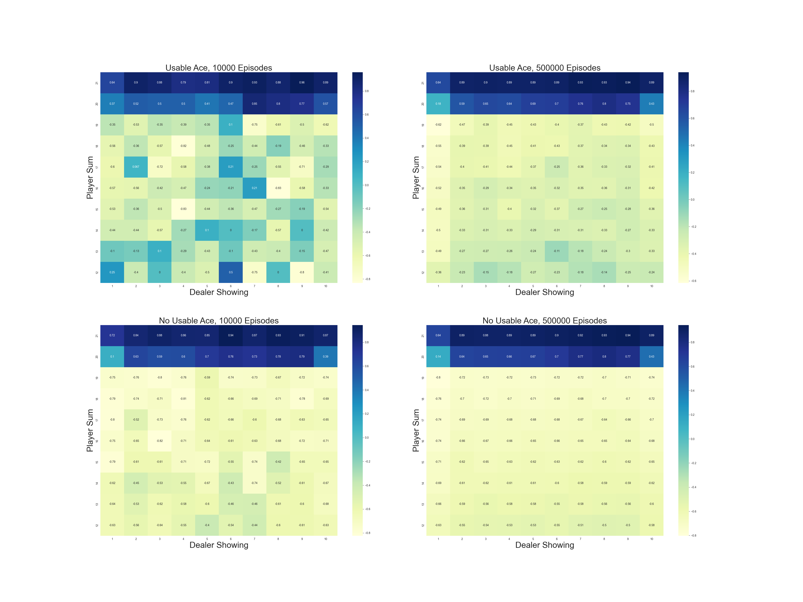

# Blackjack — Monte Carlo Methods

## Background

This notebook implements **Blackjack** using Monte Carlo methods, based on Sutton & Barto's *Reinforcement Learning: An Introduction* (Chapter 5). The game is modeled as an episodic, finite Markov Decision Process (MDP), where:

* The player aims to obtain a card sum as close as possible to 21 without exceeding it.
* Each episode represents a complete game of blackjack.
* Rewards are:

  * +1 for a win,
  * 0 for a draw,
  * −1 for a loss.
* There is **no discounting** (γ = 1), and rewards are only received at the end of an episode.

The objective is to evaluate and improve policies using **Monte Carlo Prediction**, **Monte Carlo Exploring Starts (ES)** for control, and **Off-policy Prediction via Importance Sampling**.

---

## Structure

* **Environment**:

  * Infinite deck assumption (with replacement).
  * States are characterized by:

    1. Player's current sum (12–21),
    2. Dealer's showing card (Ace–10),
    3. Whether the player has a usable ace.
  * Total state space: 200 states.

* **Policies**:

  * Initial policy: Stick only on 20 or 21.
  * Behavior policy (for off-policy learning): Random hit or stick.

* **Methods Implemented**:

  * **Monte Carlo Policy Evaluation**
  * **Monte Carlo Control with Exploring Starts**
  * **Off-Policy Prediction using Importance Sampling**

---

## Simulation Overview

### Monte Carlo Prediction

* Simulates blackjack episodes using the fixed policy (stick on 20 or 21).
* Samples returns and averages them per state.
* Evaluates separately for:

  * States **with usable ace**
  * States **without usable ace**
* Estimation quality improves with more episodes.

### Monte Carlo Control (Exploring Starts)

* Uses random initial states and actions to ensure coverage.
* Improves upon the initial policy toward an optimal policy.
* Tracks action-value function Q(s, a) and derives policy π(s) = argmax Q(s, a).
* Produces near-optimal behavior policy matching classical blackjack strategies.

### Off-policy Prediction (Importance Sampling)

* Evaluates a single state: (player sum = 13, dealer shows 2, usable ace = True).
* Generates data using a **behavior policy** and evaluates under a **target policy**.
* Compares **ordinary** and **weighted** importance sampling over 100 runs, 10,000 episodes each.
* Tracks **mean squared error** (MSE) against known true value.

---

## Figures with Interpretations

### **Figure 5.1 — Monte Carlo Prediction Results**

* Shows estimated **state-value function** for the fixed policy.
* Left: States with usable ace. Right: Without usable ace.
* Estimations become smoother and more accurate with 500,000 episodes.

---

### **Figure 5.2 — Monte Carlo Control with Exploring Starts**

* Top row: **Optimal policy** with and without usable ace.
* Bottom row: Corresponding **state-value function**.
* Learns close-to-optimal strategy from scratch using sample episodes alone.
* Matches classical "basic strategy" with minor differences.

---

### **Figure 5.3 — Off-policy Prediction via Importance Sampling**

](generated_images/figure_5_3.png)

* Mean squared error (MSE) vs number of episodes (log scale).
* Weighted importance sampling performs better in early learning stages.
* Both methods converge to true value (≈ 0.27726) over time.

---

## Reference

* Sutton, R. S., & Barto, A. G. (2018). *Reinforcement Learning: An Introduction* (2nd ed.), 
  * [Chapter 5 – Monte Carlo Methods (Blackjack)](http://incompleteideas.net/book/RLbook2020.pdf#page=109) (see page 93)

---

## Educational Objective

* Demonstrate how **Monte Carlo methods** can be used for:

  * **Policy Evaluation**
  * **Policy Improvement**
  * **Off-policy Learning**
* Emphasize:

  * The power of sampling from experience.
  * Learning from full episodes without a model of the environment.
  * Practical differences between ordinary and weighted importance sampling.
* Provide intuition into decision-making under uncertainty in sequential tasks.
