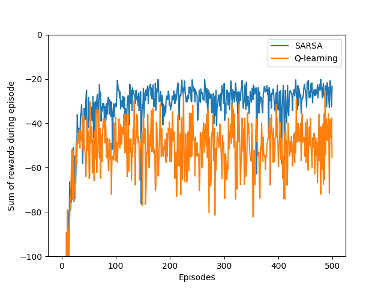
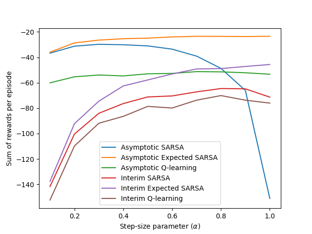

# Cliff Walking – SARSA vs Q-Learning 

## Background

This experiment explores the difference between **on-policy (SARSA)** and **off-policy (Q-learning)** learning strategies in a gridworld environment called **Cliff Walking**. The task is described in **Example 6.6** of Sutton & Barto’s *Reinforcement Learning: An Introduction* (2nd Edition, page **132–133**).

The purpose is to illustrate how the choice of learning algorithm affects the **safety** and **performance** of the learned policy when using **ε-greedy exploration**.

## Environment Structure

* **Gridworld size**: 4 rows × 12 columns.
* **Start (S)**: bottom-left corner.
* **Goal (G)**: bottom-right corner.
* **Cliff region**: cells between S and G on the bottom row.

  * **Reward**: −100 if the agent steps into the cliff.
  * Agent is teleported back to the start.
* **Normal step reward**: −1 per time step.
* **Actions**: {Up, Down, Left, Right}.
* **Episodic** task with γ = 1.

*Book grid layout (Example 6.6)*:

## Simulation Overview

* **Algorithms compared**: SARSA and Q-learning.
* **Exploration**: ε-greedy with ε = 0.1.
* **Step-size (α)**: varies in performance comparison (0.1 to 1.0).
* **Runs**: 50 independent runs for learning curve, 10 for α-sensitivity.
* **Episodes**: 500 for learning curve, 1000 for α-sensitivity.
* **Performance metrics**:

  * **Sum of rewards per episode**
  * **Interim performance** (first 100 episodes)
  * **Asymptotic performance** (entire run)

## Figures and Interpretation

### `example_6_6.png` – Learning Curves

 **SARSA vs Q-learning performance over 500 episodes**

* **X-axis**: Episodes
* **Y-axis**: Sum of rewards per episode
* **SARSA** learns a **safe** but suboptimal path (above the cliff).
* **Q-learning** converges to the **optimal policy** (close to cliff), but performance suffers due to **ε-greedy exploration** causing occasional falls.

### Optimal Policies

* **SARSA Optimal Policy**: safer, more conservative path avoiding the cliff.
* **Q-learning Optimal Policy**: shorter path next to the cliff.

Both eventually learn correct value estimates, but SARSA’s **online behavior** is more robust during exploration.

### `figure_6_3.png` – Step-size Sensitivity

**Interim and Asymptotic performance vs α**

* Shows performance comparison of:

  * **SARSA**
  * **Expected SARSA**
  * **Q-learning**
* Measured under **interim (early episodes)** and **asymptotic (final average)** performance conditions.
* Best results depend on step-size α.

## Reference

* Sutton, R. S., & Barto, A. G. (2018). *Reinforcement Learning: An Introduction* (2nd ed.).  
  * [Example 6.6 – Cliff Walking](http://incompleteideas.net/book/RLbook2020.pdf#page=132) (see page 132).

## Educational Objective

This experiment highlights how:

* **On-policy methods like SARSA** consider the **current behavior** of the agent, learning **safer strategies**.
* **Off-policy methods like Q-learning** estimate the **optimal policy**, but their **online performance** may suffer due to exploration noise.

It emphasizes the importance of matching the **control algorithm** to the **deployment needs**—e.g., exploration-time safety may be more important than final optimality.

