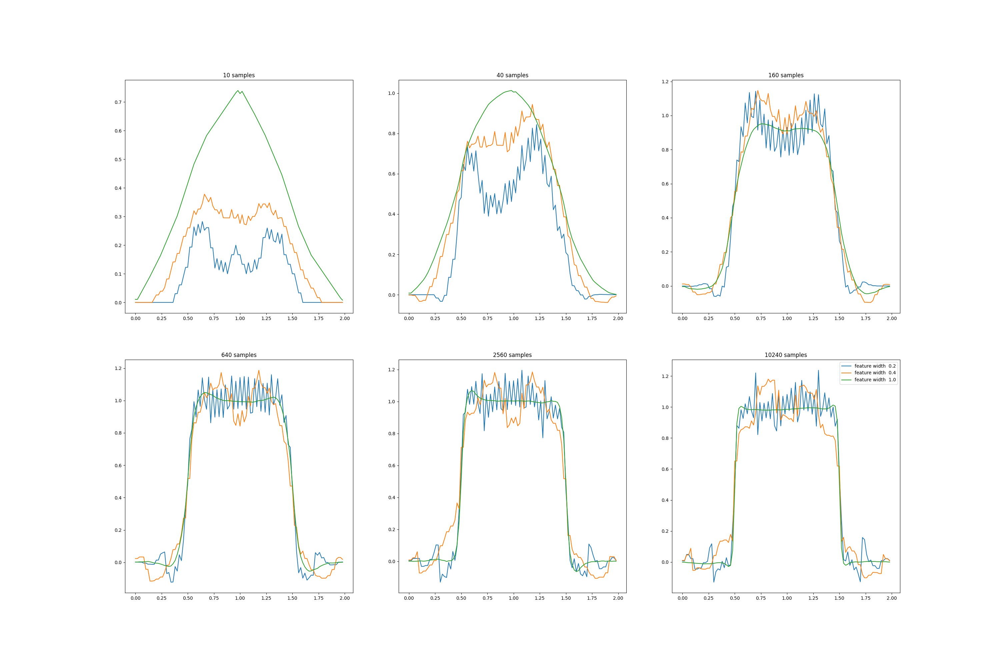

# Coarseness of Coarse Coding

This repository demonstrates **linear function approximation** using **coarse coding** to learn a 1-dimensional square-wave function. It reproduces **Figure 9.8** from Sutton & Barto, showing the effect of feature width on learning.

---

## Overview

* **Function to learn**: 1D square wave on `[0, 2)`

  * Value = 1 if `0.5 < x < 1.5`, else 0
* **Linear function approximation** with coarse coding:

  * Features = overlapping intervals
  * Step-size = `α / n_active_features`
* **Feature widths**: narrow, medium, broad
* **Training samples**: drawn uniformly from `[0, 2)`

---

## File Structure

```
src/
├─ classes.py        # Interval and ValueFunction classes
├─ square_wave.py    # square_wave(), sample(), approximate()
notebooks/
├─ coarse_coding.ipynb
book_images/
generated_images/
```

---

## Notebook: Coarseness of Coarse Coding (`coarse_coding.ipynb`)

* Explores **effect of feature width** on learning

* Training repeated with different numbers of samples: 10, 40, 160, 640, 2560, 10240

* **Feature widths**: 0.2, 0.4, 1.0

* Observations:

  * Broad features → broad generalization, smooth curves
  * Narrow features → localized updates, bumpy curves
  * Asymptotic solution quality minimally affected by width

* Output figure: 

---

## Key Concepts

* **Coarse coding**: Feature representation using overlapping intervals
* **Linear function approximation**: Sum of active feature weights
* **Step-size scaling**: `α / n_active_features`
* **Generalization**: Wider features → stronger generalization

---

## References

* Sutton, R. S., & Barto, A. G. (2018). *Reinforcement Learning: An Introduction (2nd ed.)*

  * [Chapter 9 – Function Approximation](http://incompleteideas.net/book/RLbook2020.pdf#page=220)

