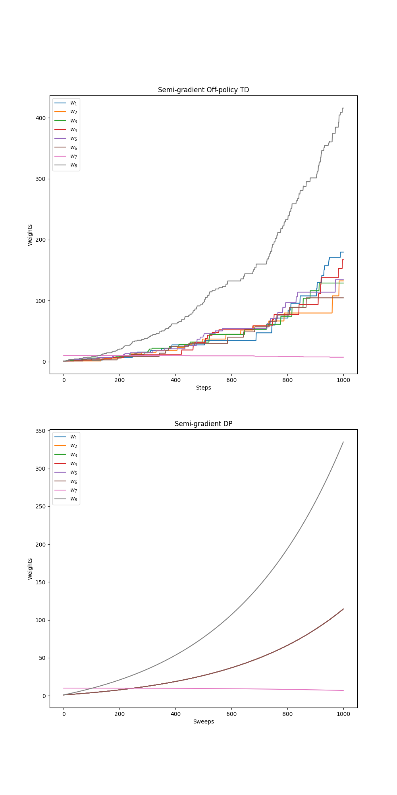

# Baird’s Counter examples

## Overview

This notebook implements **Baird’s Counterexample**, following the example in **Sutton & Barto, *Reinforcement Learning: An Introduction* (2nd Edition), Chapter 11**.

The counterexample demonstrates a situation where **semi-gradient TD methods diverge**, even under linear function approximation, highlighting the instability of off-policy learning.

---

## Environment and Problem Setup

### Task Description

* There are **7 states**: 6 upper states and 1 lower state.
* There are **2 actions**: dashed (upper states) and solid (lower state).
* Transition dynamics:

  * **Dashed action:** moves to one of the 6 upper states uniformly.
  * **Solid action:** moves to the 7th (lower) state.
* **Behavior policy (b):** dashed with probability 6/7, solid with probability 1/7 (producing a uniform next-state distribution for non-terminal states).
* **Target policy (\pi):** always solid action (concentrated in lower state).
* **Reward:** 0 for all transitions.
* **Discount factor:** (\gamma = 0.99).

---

## Objective

Evaluate **linear value function approximation** under off-policy and on-policy learning:

* Learn **weights (w)** to approximate state values: ( \hat{v}(s, w) = w^T x(s) )
* Observe **divergence** of semi-gradient off-policy TD, despite seemingly favorable conditions (linearly independent features, more weights than non-terminal states, zero reward).

---

## Algorithm: Semi-gradient TD

### Key Idea

Weights are updated using the **semi-gradient TD(0)** rule:

$$
w \leftarrow w + \alpha , \delta_t , x(s_t), \quad
\delta_t = R_{t+1} + \gamma \hat{v}(S_{t+1}, w) - \hat{v}(S_t, w)
$$

The **DP variant** updates using expected TD targets across all states, still leading to divergence.

---

## Implementation Details

* **Linear function approximation** using feature vectors (x(s)) for each state.
* **Behavior and target policies** implemented as separate functions.
* Semi-gradient TD updates applied **step by step**, or **synchronously** for DP version.
* **Weights tracking:** stored across all steps to visualize divergence.

---

## Experimental Parameters

| Parameter              | Symbol | Value | Description                                    |
| ---------------------- | ------ | ----- | ---------------------------------------------- |
| Number of states       | —      | 7     | 6 upper + 1 lower                              |
| Number of actions      | —      | 2     | dashed / solid                                 |
| Discount factor        | γ      | 0.99  | Discount rate                                  |
| Step-size              | α      | 0.01  | Learning rate for weights                      |
| Initial weights        | —      | 1, 10 | 1 for upper state weights, 10 for lower weight |
| Number of steps/sweeps | —      | 1000  | Steps for TD / sweeps for DP                   |

---

## Results and Visualization

The resulting plots reproduce **Figure 11.2** from Sutton & Barto:

1. **Semi-gradient off-policy TD** – weights diverge to infinity.
2. **Semi-gradient DP** – expected updates still diverge.

### Figure 11.2 – Weights Divergence



---

## Implementation Details

* **File:** `src/counter_example.py`

  * Implements environment dynamics (`step`, `target_policy`, `behavior_policy`).
  * Contains **semi-gradient TD**, **semi-gradient DP**, and **helper functions** (`compute_RMSVE`, `compute_RMSPBE`).
  * Includes placeholder functions for **TDC** and **Expected Emphatic TD**.

* **Notebook:** `notebooks/bairds_counterexample.ipynb`

  * Runs experiments for semi-gradient TD and DP.
  * Generates and saves plots to `generated_images/`.

---

## File Structure

```
├── Counter-examples/
│   ├── book_images/
│   │   ├── Figure_11_1.PNG
│   │   ├── Figure_11_2.PNG
│   │   ├── Figure_11_5.PNG
│   │   └── Figure_11_6.PNG
│   ├── generated_images/
│   │   └── figure_11_2.png
│   ├── notebooks/
│   │   └── bairds_counterexample.ipynb
│   ├── src/
│   │   ├── __init__.py
│   │   └── counter_example.py
│   └── README.md
```

---

## Results Summary

* Semi-gradient TD **fails off-policy**, diverging even with linear approximation.
* DP-style expected updates **do not prevent divergence**, confirming theoretical predictions.
* The counterexample motivates **Gradient-TD and Emphatic-TD methods** for stable off-policy learning.

---

## References

Sutton, R. S., & Barto, A. G. (2018). *Reinforcement Learning: An Introduction (2nd ed.)*

* [Chapter 11 – Example: Baird’s Counterexample](http://incompleteideas.net/book/RLbook2020.pdf#page=273) (see page 261)
