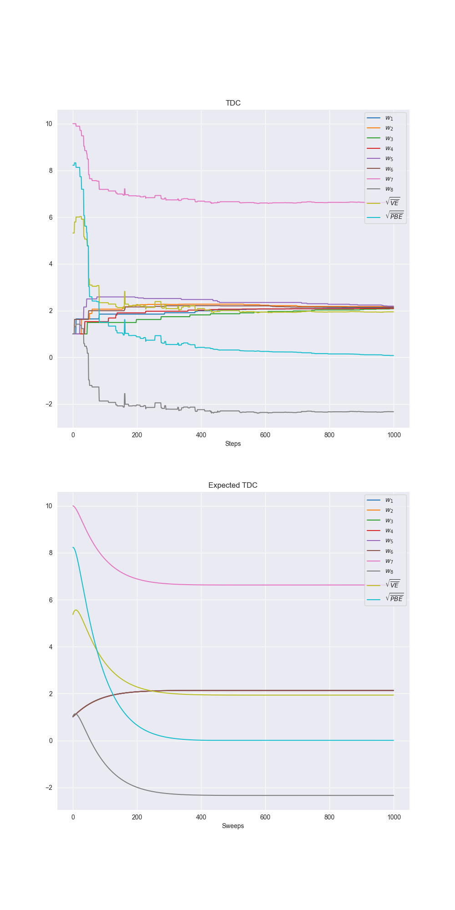
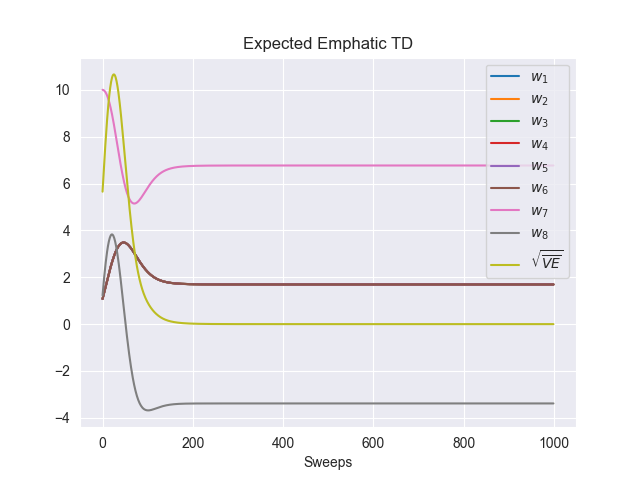

# Baird’s Counterexamples – Off-policy TD, TDC, and Emphatic-TD

## Overview

This project implements and experiments with **Baird’s Counterexample**, a classic example of divergence in **off-policy temporal-difference learning** with linear function approximation, as described in **Sutton & Barto, *Reinforcement Learning: An Introduction* (2nd Edition), Chapter 11**.

The experiments cover:

* **Semi-gradient off-policy TD(0)**
* **Semi-gradient DP updates**
* **TDC (Gradient-corrected TD)**
* **Expected TDC**
* **Expected Emphatic-TD**

These implementations highlight instability in naive off-policy TD learning and demonstrate the convergence behavior of gradient-corrected and emphatic TD algorithms.

---

## Environment and Problem Setup

### Task Description

* A **7-state, 2-action MDP**:

  * **States 0–5:** upper states
  * **State 6:** lower state

* **Actions:**

  * **Dashed:** transitions uniformly to one of the upper states (0–5)
  * **Solid:** transitions to the lower state (6)

* **Behavior policy:** selects **dashed** with probability 6/7 and **solid** with 1/7.

* **Target policy:** always selects **solid**, concentrating the on-policy distribution on the lower state.

* **Reward:** 0 for all transitions.

* **Discount factor:** γ = 0.99

### Linear Function Approximation

* Each state has an **8-dimensional feature vector**.
* Upper states: feature i = 2, last feature = 1
* Lower state: pre-last feature = 1, last feature = 2
* True value function: v_π(s) = 0, ∀s
* Many solutions exist (d = 8 > |S| = 7)

---

## Algorithms

### Semi-gradient Off-policy TD

* Updates weights using the **importance-sampled TD(0) rule**.
* Even with small step sizes, the algorithm **diverges** (Figure 11.2, left).

### Semi-gradient DP

* Performs expected updates for all states simultaneously using the **semi-gradient DP target**.
* Instability persists even without stochasticity (Figure 11.2, right).

### TDC (Gradient-corrected TD)

* Temporal-Difference with Gradient Correction (GTD(0)) stabilizes learning.
* Reduces **RMS projected Bellman error (RMS-PBE)** but convergence of weights to true VF is slow (Figure 11.5).

### Expected TDC

* Synchronous expected update version of TDC.
* Reduces RMS-PBE and RMS value error more predictably.

### Expected Emphatic-TD

* Synchronous, variance-free expected update using emphasis weighting.
* Eventually converges to the optimal solution, RMS-VE → 0 (Figure 11.6).
* High variance makes direct simulation challenging, but expectation computation shows convergence.

---

## Experimental Parameters

| Parameter           | Symbol | Value                 | Description                                 |
| ------------------- | ------ | --------------------- | ------------------------------------------- |
| States              | S      | 7                     | Number of states                            |
| Actions             | A      | 2                     | Dashed, Solid                               |
| Feature vector size | d      | 8                     | Linear function approximation dimension     |
| Discount factor     | γ      | 0.99                  | Future reward discounting                   |
| Behavior policy     | —      | 6/7 dashed, 1/7 solid | Action selection probabilities              |
| Steps / sweeps      | —      | 1000                  | Number of updates per experiment            |
| Step sizes          | α, β   | 0.01–0.05             | Learning rates for weights and LLS solution |
| Interest            | I      | 1                     | For Emphatic-TD                             |

---

## Results and Visualization

### Figure 11.2 – Semi-gradient TD Divergence

* **Left:** Semi-gradient off-policy TD weights diverge
* **Right:** Semi-gradient DP expected updates also diverge


### Figure 11.5 – TDC Convergence

* TDC reduces **RMS-PBE**, but individual weights are still far from optimal
* Expected TDC shows smoother convergence



### Figure 11.6 – Expected Emphatic-TD

* RMS value error converges to zero
* Algorithm is stable in expectation, despite high variance in sampling



---

## Implementation Details

* **File:** `src/counter_example.py`

  * Implements Baird’s counterexample environment and feature vectors
  * Includes **semi-gradient TD**, **semi-gradient DP**, **TDC / Expected TDC**, **Expected Emphatic-TD**
  * Computes **RMS value error (RMS-VE)** and **RMS projected Bellman error (RMS-PBE)**

* **Notebooks:**

  * `notebooks/bairds_counterexample.ipynb` – Semi-gradient TD and DP experiments
  * `notebooks/tdc_baird.ipynb` – TDC and expected TDC experiments
  * `notebooks/emphatic_baird.ipynb` – Expected Emphatic-TD experiments

---

## File Structure

```
├── counter-examples/
│   ├── book_images/
│   │   ├── Figure_11_1.PNG
│   │   ├── Figure_11_2.PNG
│   │   ├── Figure_11_5.PNG
│   │   └── Figure_11_6.PNG
│   ├── generated_images/
│   │   ├── figure_11_2.png
│   │   ├── figure_11_5.png
│   │   └── figure_11_6.png
│   ├── notebooks/
│   │   ├── bairds_counterexample.ipynb
│   │   ├── tdc_baird.ipynb
│   │   └── emphatic_baird.ipynb
│   ├── src/
│   │   ├── __init__.py
│   │   └── counter_example.py
│   └── README.md
```

---

## Results Summary

* Semi-gradient off-policy TD is **unstable**, diverging for any positive step size.
* Gradient-corrected methods (TDC / Expected TDC) **stabilize learning**, reduce RMS-PBE.
* Expected Emphatic-TD **converges in expectation** to the optimal solution despite variance in practical experiments.
* This project demonstrates key insights about **off-policy TD divergence**, **importance sampling**, and **emphatic weighting** in reinforcement learning.

---

## References

Sutton, R. S., & Barto, A. G. (2018). *Reinforcement Learning: An Introduction (2nd ed.)*

* [Chapter 11 – Off-policy TD, Baird’s counterexample](http://incompleteideas.net/book/RLbook2020.pdf#page=252) (see page 260)
