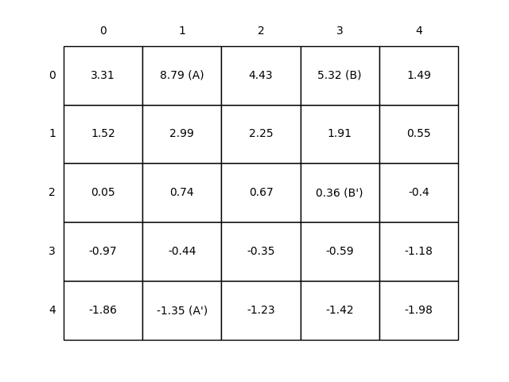
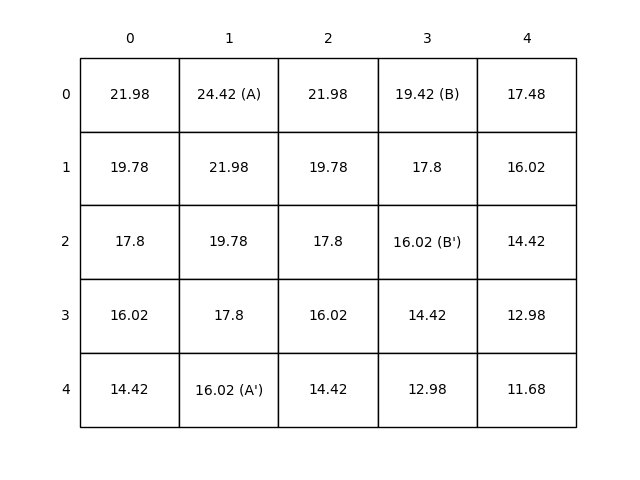
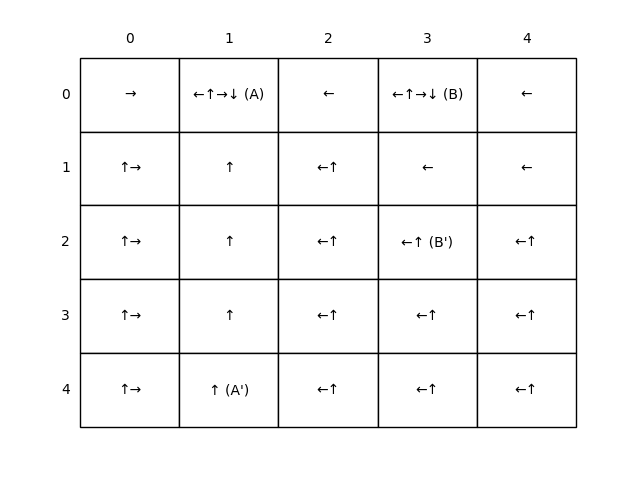

# Gridworld as Finite MDP

This repository provides an implementation of the **Gridworld example** from Chapter 3 of the book *Reinforcement Learning: An Introduction* by Richard S. Sutton and Andrew G. Barto. It explores **finite Markov Decision Processes (MDPs)**, value functions under random and optimal policies, and visualizes state values and derived policies in grid-based environments.

---

## Background

The **Gridworld** is a classic finite MDP setup where:

* The environment is a rectangular grid.
* Each **cell is a state**, and the agent can take 4 deterministic actions: north, south, east, and west.
* Hitting the boundary results in a reward of **−1** and staying in place.
* Moving from special states **A** and **B** transports the agent to **A′** and **B′**, with rewards of **+10** and **+5** respectively.

This simulation compares the behavior of:

1. A **random policy** where all actions are selected with equal probability.
2. The **optimal value function and policy**, computed via **iterative policy evaluation** and **Bellman optimality updates**.

---

## Structure

* `src/grid_world.py`:
  Contains helper functions such as:

  * `step(state, action)`: transition function
  * `draw(grid, is_policy=False)`: for rendering value tables and policies

* `notebooks/gridworld.ipynb`:

  * Simulates the environment under a random policy
  * Computes the optimal value function and corresponding policy

* `generated_images/`:
  Contains output images for value functions and policies.

---

## Simulation Overview

We simulate the gridworld with the following setup:

* The grid is **5×5**
* Under the random policy, each action has a probability of **¼**
* The discount factor is **γ = 0.9**
* Two stages are visualized:

  1. Evaluation of the **random policy**.
  2. Computation of the **optimal value function and policy** using value iteration.

---

## Figures & Their Meanings

### Figure 3.2 — Value Function under a Random Policy

This figure shows the **state-value function** $v_{\pi}$ under a uniform random policy, with γ = 0.9.

* **Negative values** near the grid edges reflect the frequent collisions (penalties).
* **State A** appears valuable, but its future trajectory leads to edge penalties, so its expected return is **less than +10**.
* **State B** has an expected value **greater than +5**, due to its successor state's proximity to rewarding transitions.

**Purpose**: To demonstrate how even a random policy yields nontrivial expected returns due to environment structure.

---

### Figure 3.5 (middle) — Optimal State-Value Function

This value function $v_*$ is computed by applying **Bellman optimality updates** until convergence.

**Purpose**: Visualizes the **best possible return** from each state, under the optimal policy. The highest values are centered around the transitions from special states and their successors.

---

### Figure 3.5 (right) — Optimal Policy Derived from $v_*$

Arrows represent the **optimal actions** from each state. In some cells, multiple actions are equally optimal.

**Purpose**: Shows the derived **greedy policy** w\.r.t the optimal value function. The agent is steered toward high-reward states or safer paths avoiding penalties.

---

##  Reference

* Sutton, R. S., & Barto, A. G. (2018). *Reinforcement Learning: An Introduction (2nd ed.)*.
  * [Chapter 4 – Gridworld as a Markov Decision Process](http://incompleteideas.net/book/RLbook2020.pdf#page=80) (see page 65)

---

## Educational Objective

This project is meant for **educational use**, helping students build **intuition about value functions**, **Bellman equations**, and the role of **policies** in MDPs. By working with a simple yet expressive grid environment, the concepts of **reward propagation**, **state evaluation**, and **policy derivation** are made visual and interpretable.

