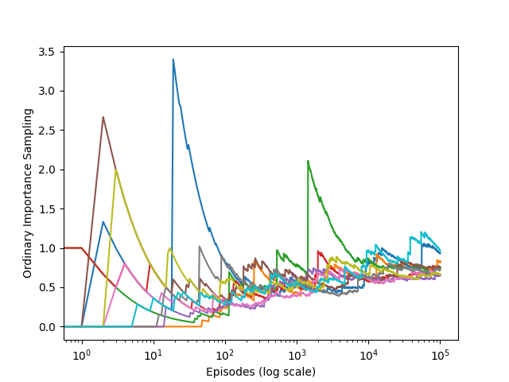

# Infinite Variance in Off-Policy Learning

This repository implements an example from **Chapter 5** of *Reinforcement Learning: An Introduction* by Richard S. Sutton and Andrew G. Barto. It demonstrates the issues that arise with **ordinary importance sampling** when dealing with **infinite variance** in off-policy learning. The experiment compares **ordinary importance sampling** with **weighted importance sampling**, showcasing the divergence in their performance.

---

## Background

In off-policy learning, **ordinary importance sampling** can lead to **infinite variance** when the scaled returns have infinite variance. This often occurs when trajectories contain loops, which is the case in this example. We simulate an agent's behavior using two policies:

1. **Behavior Policy**: Chooses actions (`right` or `left`) with equal probability.
2. **Target Policy**: Always chooses the `left` action.

The task is to estimate the value of a state under the target policy using off-policy data generated from the behavior policy. **Infinite variance** occurs because the trajectory could loop infinitely due to the left action (with a 90% probability of staying in the same state).

---

## Structure

* `src/infinite_variance.py`:
  Contains core functions for simulating actions and calculating rewards with importance sampling:

  * `play()`: Simulates an episode and returns the reward and action trajectory.
  * `actions`: Defines the available actions (`right`, `left`).
* `generated_images/`:
  Contains output images from the simulations, including plots for ordinary importance sampling estimates.

---

## Simulation Overview

We simulate the environment with the following setup:

* The agent starts in a single non-terminal state (`s`).
* **Right action** leads to termination with no reward.
* **Left action** either leads back to `s` (90% probability) or to termination with a reward of +1 (10% probability).
* The **behavior policy** selects `left` and `right` with equal probability.
* The **target policy** always selects `left`.

### Two Methods for Estimation:

1. **Ordinary Importance Sampling**: Uses unweighted returns to estimate the value function.
2. **Weighted Importance Sampling**: Weights each return according to the importance sampling ratio, giving a more accurate estimate.

---

## Figures & Their Meanings

### Figure 5.4 — Ordinary Importance Sampling in Off-Policy Learning

This plot shows the estimates of value using **ordinary importance sampling** over 10 independent runs, with millions of episodes. Even after many episodes, the estimates do not converge to the true value due to infinite variance.

**Purpose**: To demonstrate the slow convergence and instability caused by **ordinary importance sampling** when estimating off-policy values.

---

## Reference

* Sutton, R. S., & Barto, A. G. (2018). *Reinforcement Learning: An Introduction (2nd Edition)*.

  * [Chapter 5 – Monte Carlo Methods](http://incompleteideas.net/book/RLbook2020.pdf#page=97)

---

## Educational Objective

This project is meant to help students understand the concepts of **importance sampling**, **infinite variance** in off-policy learning, and the **challenges** in stabilizing learning under such conditions. By visualizing both **ordinary** and **weighted importance sampling**, it is easier to grasp the effect of variance in off-policy estimation and the role of careful reward weighting in improving convergence.

