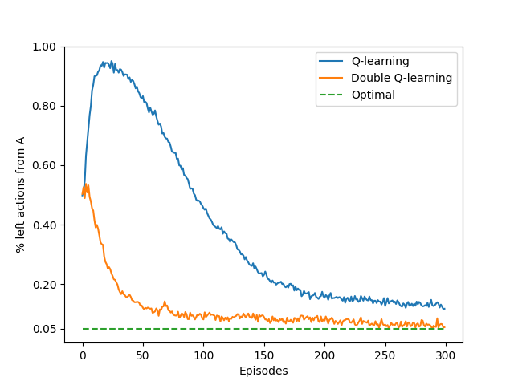

# Maximization Bias — Q-learning vs Double Q-learning

This project empirically demonstrates the **maximization bias** phenomenon in **Temporal-Difference (TD) control** methods, comparing **Q-learning** and **Double Q-learning** on a small **Markov Decision Process (MDP)**, as illustrated in Sutton & Barto’s *Reinforcement Learning: An Introduction* (Chapter 6, Figure 6.5).

---

## Background

The MDP consists of **2 non-terminal states**: `A` and `B`, and a terminal state:

```
A → {left → B, right → Terminal}
B → {10 actions → Terminal with stochastic reward}
Terminal
```

* Episodes always start in state **A**.
* From **A**, the agent can choose:

  * **left** → moves to **B** with reward 0
  * **right** → moves directly to **Terminal** with reward 0
* From **B**, there are **10 actions**, all leading to **Terminal** with reward sampled from a normal distribution:
  ( \mu = -0.1, \sigma = 1.0 )
* The **optimal policy** is to choose **right** in state A, but **maximization bias** can make **left** appear favorable in standard Q-learning.

This environment is a classical example of **overestimation bias** when selecting the max action value.

---

## Structure

* `src/maximization_bias.py`

  * Implements the MDP environment
  * Contains **Q-learning** and **Double Q-learning** algorithms
  * Implements **ε-greedy** action selection

* `notebooks/maximization_bias_example.ipynb`

  * Sets up simulation parameters
  * Runs multiple independent **experiments**
  * Tracks the proportion of `left` actions in state A over episodes
  * Plots the results (reproducing Figure 6.5)

* `book_images/Figure_6_5_mdp.PNG`

  * Diagram of the MDP used

* `book_images/Figure_6_5_graph.PNG`

  * Illustration of maximization bias in action selection

* `generated_images/figure_6_5.png`

  * Plot generated from the notebook simulation

* `README.md`

  * This file

---

## Simulation Overview

* **Runs**: 1000 independent experiments
* **Episodes**: 300 per run
* **Step-size α**: 0.1
* **Discount factor γ**: 1.0
* **Exploration probability ε**: 0.1

For each episode:

* **Q-learning** updates the action-value estimate using:

  [
  Q(S_t, A_t) \leftarrow Q(S_t, A_t) + \alpha \left[ R_{t+1} + \gamma \max_a Q(S_{t+1}, a) - Q(S_t, A_t) \right]
  ]

* **Double Q-learning** splits updates between two value estimates (Q_1) and (Q_2), reducing overestimation:

  [
  Q_1(S_t, A_t) \text{ or } Q_2(S_t, A_t) \text{ updated using the other estimate for max-action selection}
  ]

The **percentage of `left` actions from state A** is recorded for each method.

---

## Figures and Interpretation

### Maximization Bias Plot (Reproduction of Figure 6.5)



* **Q-learning** initially overestimates the value of `left` in state A, favoring it more than optimal.
* **Double Q-learning** mitigates this bias, staying closer to the **optimal choice** (`right`) throughout.
* Even asymptotically, Q-learning selects `left` **≈5% more** than optimal under the given parameters (ε=0.1, α=0.1, γ=1.0).

---

## Reference

* Sutton, R. S., & Barto, A. G. (2018). *Reinforcement Learning: An Introduction (2nd ed.)*

  * [Chapter 6 – Maximization Bias](http://incompleteideas.net/book/RLbook2020.pdf#page=139) (see page 136)

---

## Educational Objective

This experiment illustrates:

* The **effect of maximization bias** on standard Q-learning
* How **Double Q-learning** can correct overestimation in max-based action selection
* The role of **ε-greedy exploration** and **stochastic rewards** in shaping perceived action values
* Why controlling overestimation is crucial in reinforcement learning control tasks

This example provides an essential insight into **bias in value estimation** and highlights a key advantage of **Double Q-learning** in practical applications.
