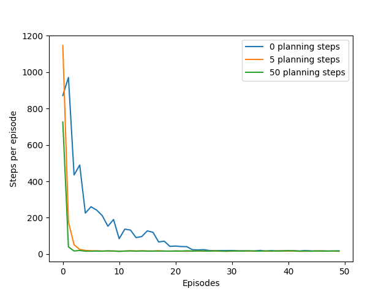
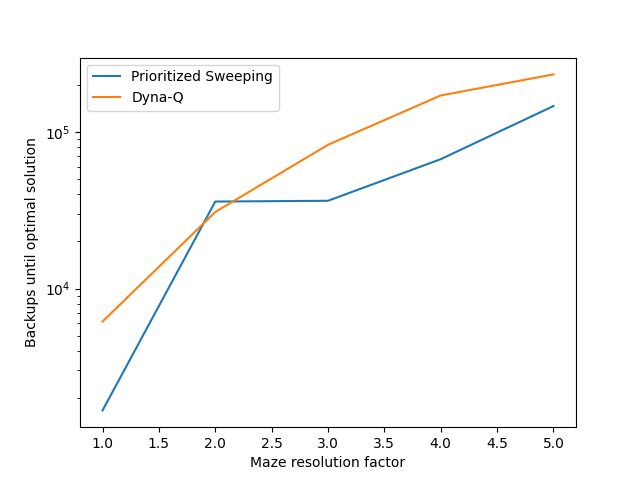

# Dyna-Q, Dyna-Q+, and Prioritized Sweeping on Maze Tasks

This project demonstrates **Dyna-Q**, **Dyna-Q+**, and **Prioritized Sweeping** algorithms on maze navigation tasks. It is based on Sutton & Barto’s *Reinforcement Learning: An Introduction* (Chapter 8, Figures 8.2–8.4), showing how **planning and model-based updates** accelerate learning and improve policy efficiency in reinforcement learning.

---

## Background

The environment consists of a **grid maze** with:

* **States**: Each cell in the grid is a state.
* **Actions**: Up, down, left, right, moving deterministically unless blocked by an obstacle or the maze edge.
* **Reward**: 0 for all transitions except reaching the goal state, which gives +1.
* **Episodes**: Start at the initial state `S` and end at the goal state `G`. After reaching the goal, the agent resets to the start state.

Key concepts demonstrated:

* **Dyna-Q**: Combines real experience and planning from a learned model.
* **Dyna-Q+**: Adds a **bonus reward** for untried actions to encourage exploration in changing environments.
* **Prioritized Sweeping**: Updates high-priority state-action pairs first, dramatically speeding up learning.

---

## Structure

* `src/dyna.py`

  * Contains **DynaParams** class for hyperparameters
  * Supports multiple algorithms: Dyna-Q, Dyna-Q+
  * Stores settings like discount, step-size, planning steps, exploration probability

* `src/functions.py`

  * Implements **ε-greedy action selection**
  * Runs **Dyna-Q**, **Dyna-Q+**, **changing maze experiments**, and **Prioritized Sweeping**
  * Handles cumulative reward tracking and episode loops

* `src/maze.py`

  * Maze environment class
  * Supports **state extension** for higher-resolution mazes
  * Handles **state transitions** and obstacles

* `src/models.py`

  * **TrivialModel**: simple experience-based model for Dyna-Q
  * **TimeModel**: adds time-based bonus for Dyna-Q+ (encourages exploration)
  * **PriorityModel**: maintains priority queue for **Prioritized Sweeping**
  * **PriorityQueue**: utility class to handle state-action priorities

* `notebooks/dyna_maze.ipynb`

  * Reproduces **Figure 8.2** learning curves for different planning steps
  * Compares Dyna-Q performance across multiple episodes and runs

* `notebooks/changing_mazes.ipynb`

  * Demonstrates **Dyna-Q+** in a dynamic maze where obstacles change
  * Illustrates the effect of the **bonus reward** for untried actions

* `notebooks/prioritized_sweeping.ipynb`

  * Demonstrates **Prioritized Sweeping** vs standard Dyna-Q
  * Tracks **number of backups** to reach optimal policy in increasing maze resolutions

* `book_images/` and `generated_images/`

  * Contains source images for diagrams and simulation-generated figures

---

## Simulation Overview

* **Runs**: 5–10 independent experiments depending on notebook
* **Episodes**: 50 for standard Dyna-Q; dynamic mazes may track more steps
* **Step-size α**: 0.1–0.5
* **Discount factor γ**: 0.95
* **Exploration probability ε**: 0.1
* **Planning steps n**: 0, 5, 50 (varied to show effect on learning speed)
* **Priority threshold θ**: 0.0001 (for Prioritized Sweeping)
* **Time bonus κ**: small (1e-4) for Dyna-Q+

Each algorithm updates action-value estimates using:

* **Dyna-Q**:

  $$
Q(S_t, A_t) \leftarrow Q(S_t, A_t) + \alpha \Big[ R_{t+1} + \gamma \max_a Q(S_{t+1}, a) - Q(S_t, A_t) \Big]
$$

* **Dyna-Q+**: adds **time-based bonus** for untried actions:

$$
r \rightarrow r + \kappa \sqrt{\tau} \quad \text{for actions untried for } \tau \text{ steps}
$$

* **Prioritized Sweeping**: updates state-action pairs in **priority order**, based on potential impact on value estimates.

---

## Figures and Interpretation

### Dyna-Q Learning Curves (Reproduction of Figure 8.2)

* Higher planning steps (`n=50`) significantly reduce the number of steps per episode.
* Non-planning agent (`n=0`) learns slowly, taking more episodes to reach optimal performance.

### Dyna-Q+ Shortcut Maze Exploration

* Dyna-Q+ encourages testing long-untried actions via bonus rewards.
* This computational curiosity improves adaptation when obstacles change.
* Bonus reward: `r + κ √τ`, increasing likelihood of exploring actions whose outcome may have changed.

### Prioritized Sweeping (Reproduction of Figure 8.4)

* Prioritized Sweeping achieves optimal policy with fewer backups compared to unprioritized Dyna-Q.
* Advantage increases with **maze resolution**.
* Focuses computation on state-action pairs with high potential for value change.

---

## Reference

* Sutton, R. S., & Barto, A. G. (2018). *Reinforcement Learning: An Introduction (2nd ed.)*

  * [Chapter 8 – Planning and Learning with Tabular Methods](http://incompleteideas.net/book/RLbook2020.pdf#page=194)

---

## Educational Objective

This project illustrates:

* How **planning accelerates learning** in reinforcement learning tasks
* The role of **model-based updates** in Dyna-Q and Dyna-Q+
* How **bonus rewards for untried actions** encourage exploration in changing environments
* The efficiency of **Prioritized Sweeping** in updating only the most important state-action pairs
* Practical understanding of **action-value estimation**, **ε-greedy exploration**, and **computational curiosity**

This example provides essential insights into **planning vs. model-free learning** and demonstrates algorithmic strategies to improve convergence speed and policy quality in maze navigation tasks.
