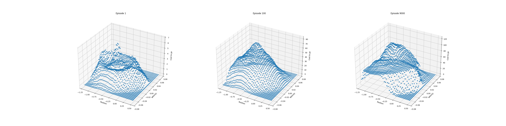
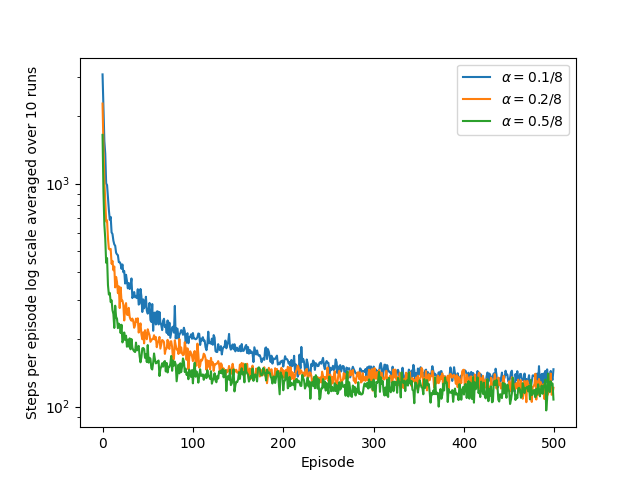
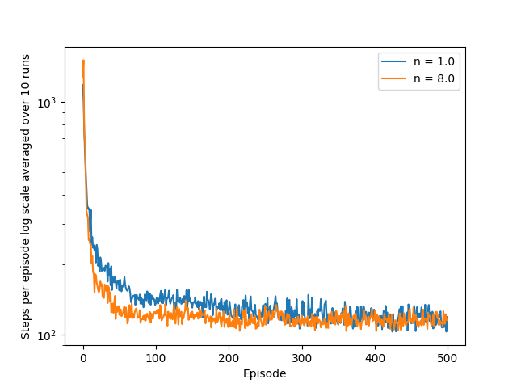
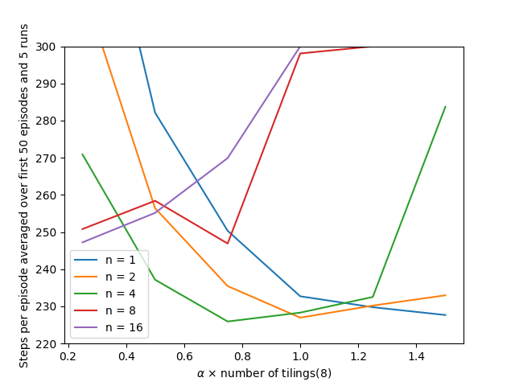

# Mountain Car – Semi-gradient n-step SARSA

## Overview

This notebook implements **semi-gradient n-step SARSA** using **tile coding** on the classic **Mountain Car** environment.
The project reproduces and extends key results from **Sutton & Barto, Reinforcement Learning: An Introduction (2nd Edition), Chapter 10**.
It demonstrates how function approximation techniques can effectively handle continuous state spaces in control tasks.

---

## Environment and Problem Setup

### Environment

* **Environment:** Mountain Car (continuous state, discrete action)
* **State space:** 2-dimensional (position, velocity)
* **Action space:** 3 discrete actions (push left, no push, push right)
* **Goal:** Reach the top of the right hill (position ≥ 0.5)

The Mountain Car task is challenging because the agent must first move away from the goal to gain momentum.
This environment tests the agent’s ability to learn from **delayed rewards** and **sparse feedback**.

---

## Algorithm: Semi-gradient n-step SARSA with Tile Coding

### Core Idea

* **Semi-gradient n-step SARSA** extends SARSA by updating the value function using *n-step returns*, enabling faster learning and better temporal credit assignment.
* **Tile coding** is used to approximate the action-value function ( Q(s, a; \mathbf{w}) ), allowing generalization across continuous states.

### Key Components

1. **Tile coding** – The continuous state is encoded via multiple overlapping grids (tilings). Each active tile indexes into the weight vector, producing a linear approximation of ( Q ).
2. **n-step SARSA updates** – The return target uses ( n ) steps of experience before bootstrapping:
   [
   G_{t:t+n} = R_{t+1} + \gamma R_{t+2} + \dots + \gamma^{n-1}R_{t+n} + \gamma^n Q(S_{t+n}, A_{t+n})
   ]
3. **Semi-gradient update rule:**
   [
   \mathbf{w} \leftarrow \mathbf{w} + \alpha \left( G_{t:t+n} - Q(S_t, A_t; \mathbf{w}) \right) \nabla_{\mathbf{w}} Q(S_t, A_t; \mathbf{w})
   ]
4. **Exploration:** ε-greedy policy with constant ε.

---

## Experiments and Figures

This notebook reproduces **Figures 10.1–10.4** from Sutton & Barto (2018), illustrating the learning dynamics of n-step SARSA on the Mountain Car problem.

---

### Figure 10.1 – 1-step SARSA Learning Curve

Shows convergence of **1-step SARSA** using tile coding, averaged over multiple runs.
The metric is *average steps per episode* over training episodes.



---

### Figure 10.2 – Comparing 1-step vs 10-step SARSA

Compares learning speed between **1-step** and **10-step SARSA**.
Multi-step updates improve sample efficiency and reduce training time.



---

### Figure 10.3 – Sensitivity to α and n

Analyzes performance sensitivity to the **step-size (α)** and **n-step** parameters.
The contour plot shows average returns per episode across different configurations.



---

### Figure 10.4 – Episodic Returns for Different n Values

Illustrates the bias–variance tradeoff: smaller n gives stable but slower learning, larger n yields faster but noisier learning.



---

## Implementation Notes

* The **tile coder** uses multiple overlapping tilings with uniform offsets for position and velocity dimensions.
* **Feature vectors** are sparse: only one feature per tiling is active at a time.
* **Weights** are stored in a flat array for vectorized computation.
* Experiments are fully reproducible using fixed random seeds and consistent Gym interfaces.

---

## Dependencies

```bash
pip install numpy matplotlib gym tqdm
```

---

## File Structure

```
├── mountain_car_sarsa.ipynb      # Main Jupyter notebook
├── utils/
│   ├── tile_coding.py            # Tile coding implementation
│   └── plotting.py               # Visualization utilities
├── generated_images/
│   ├── figure_10_1.png
│   ├── figure_10_2.png
│   ├── figure_10_3.png
│   └── figure_10_4.png
└── README.md                     # This file
```

---

## Key Hyperparameters

| Parameter   | Description                   | Typical Value     |
| ----------- | ----------------------------- | ----------------- |
| α           | Step size                     | 0.1 / num_tilings |
| γ           | Discount factor               | 1.0               |
| n           | Number of steps               | 1, 8, 10          |
| ε           | Exploration rate              | 0.1               |
| num_tilings | Number of overlapping tilings | 8                 |
| num_tiles   | Tiles per tiling              | 8                 |

---

## Results Summary

* Tile coding enables **fast and stable learning** in continuous domains.
* Increasing **n** improves early performance but can increase instability at higher α.
* Reproduced curves align with Sutton & Barto’s reference results.
* Demonstrates the **effectiveness of linear function approximation** with temporal-difference updates.

---

## References

* Sutton, R. S., & Barto, A. G. (2018). *Reinforcement Learning: An Introduction (2nd ed.)*

  * [Chapter 10 – Episodic Semi-gradient Control](http://incompleteideas.net/book/RLbook2020.pdf#page=139) (see page 244)
