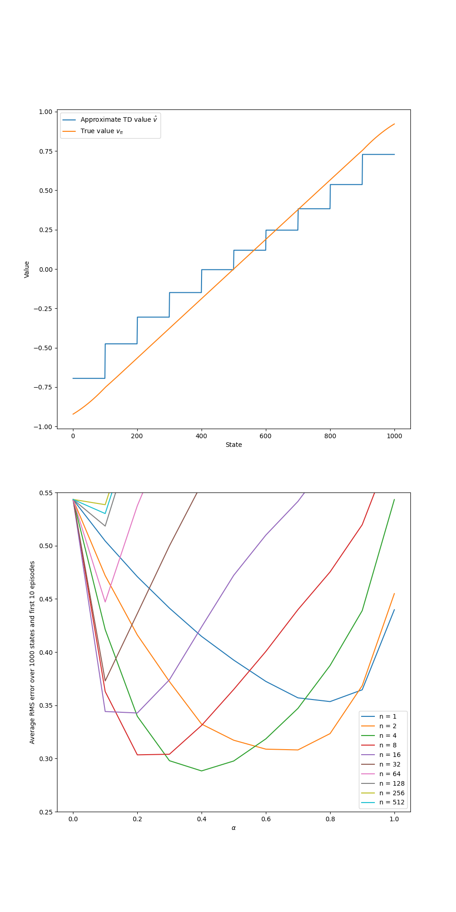

# 1000-State Random Walk Experiments

This repository explores **function approximation and bootstrapping** in **reinforcement learning**, reproducing selected figures from Sutton & Barto’s *Reinforcement Learning: An Introduction* (Chapter 9).

---

## Overview

* **Environment**: 1000-state random walk
* **Start state**: 500
* **Terminal states**: 0 (reward -1), 1001 (reward +1)
* **Actions**: left (-1) or right (+1) with random step length up to 100
* **Algorithms**: Gradient Monte Carlo, Semi-gradient n-step TD
* **Value functions**: Aggregation, Polynomial, Fourier, Tile Coding

---

## File Structure

```
src/
├─ random_walk.py
notebooks/
├─ bootstrappin.ipynb
├─ Polynomials VS Fourier Basis.ipynb
├─ State Aggregation.ipynb
├─ Tile Coding.ipynb
book_images/
generated_images/
```

---

## Experiments

### 1. Bootstrapping with Aggregation (`bootstrappin.ipynb`)

* Semi-gradient TD(0) with **10 groups of 100 states**
* Left plot: Approximate TD vs true values
* Right plot: RMS error across n-step TD
* Output figure: 

---

### 2. Polynomials vs Fourier Bases (`Polynomials VS Fourier Basis.ipynb`)

* Compare **RMS error** for basis orders 5, 10, 20
* Fourier bases outperform polynomials for online learning
* Output figure: 

---

### 3. State Aggregation with MC (`State Aggregation.ipynb`)

* 10 groups of 100 states
* Tracks approximate value function and **state visitation distribution**
* Output figure:

  * Approximate vs true values: 
  * State distribution included in the same figure

---

### 4. Tile Coding (`Tile Coding.ipynb`)

* Compare **multiple offset tilings (50)** vs single tiling
* RMS error over episodes demonstrates improved asymptotic performance
* Output figure: 

---

## Key Observations

* **TD methods** learn faster than Monte Carlo.
* **State aggregation** reduces dimensionality but introduces bias.
* **Fourier bases** outperform polynomials.
* **Tile coding** with multiple tilings improves approximation.
* RMS error illustrates trade-offs between **step size, n-step returns, and function approximation**.

---

## References

* Sutton, R. S., & Barto, A. G. (2018). *Reinforcement Learning: An Introduction (2nd ed.)*

  * [Chapter 9 – Function Approximation](http://incompleteideas.net/book/RLbook2020.pdf#page=220)

---

## Educational Objectives

* Understand **bootstrapping vs Monte Carlo**
* Explore **function approximation** in large MDPs
* Compare **aggregation, polynomial, Fourier, and tile coding**
* Analyze effects of **step size, n-step returns, and tilings**

