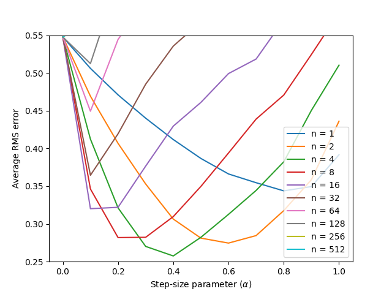

# n-step TD Methods on the Random Walk

This repository implements the **n-step TD methods** experiment from Chapter 7 of *Reinforcement Learning: An Introduction* by Sutton & Barto. It reproduces **Figure 7.2**, which compares the performance of different n-step TD methods on the 19-state random walk task.

---

## Background

In Example 6.2, Sutton & Barto introduced the random walk problem with 5 states. In Chapter 7, this is extended to 19 states to analyze the performance of **n-step TD methods**.

* Left terminal state: return –1
* Right terminal state: return +1
* Discount factor: γ = 1
* Initial values: all states initialized to 0
* Behavior policy: chooses left/right with equal probability

The experiment demonstrates that methods with intermediate values of *n* can outperform the extremes:

* **TD(0):** updates only one step at a time (low bias, high variance).
* **Monte Carlo (n → ∞):** waits until the end of the episode (low variance, high bias).
* **n-step TD:** balances between bias and variance.

---

## Structure

* `src/random_walk.py`: Core implementation of the random walk environment and the n-step TD update rule (`temporal_difference`).
* `notebooks/chapter_7_random_walk.ipynb`: Main notebook running the experiment across multiple values of *n* and α.
* `generated_images/figure_7_2.png`: Output plot replicating Sutton & Barto’s Figure 7.2.

---

## Simulation Overview

* **Runs:** 100 independent runs
* **Episodes:** 10 per run
* **Steps (n):** {1, 2, 4, 8, …, 512}
* **Step-sizes (α):** \[0.0, 0.1, …, 1.0]
* **Performance metric:** RMS error between estimated and true state values, averaged over the first 10 episodes and 100 runs.

---

## Figures & Their Meanings

**Figure 7.2 — Performance of n-step TD methods**

* Shows average RMS error across α for different values of n.
* Intermediate values of n achieve the lowest error.
* Confirms that n-step TD can outperform both TD(0) and Monte Carlo.

---

## Reference

* Sutton, R. S., & Barto, A. G. (2018). *Reinforcement Learning: An Introduction* (2nd ed.).

  * [Chapter 7 – n-step Bootstrapping](http://incompleteideas.net/book/RLbook2020.pdf#page=97) (see Figure 7.2, page 153)

---

## Educational Objective

This project illustrates the trade-off between TD and Monte Carlo methods by exploring **n-step TD**. By experimenting with different n values and learning rates, students can visualize how intermediate n achieves the best balance of bias and variance, motivating the development of **eligibility traces** as a more general approach.

