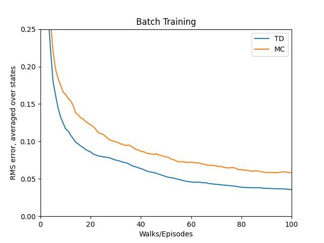

# Random Walk — TD(0) vs Monte Carlo Prediction

This project empirically compares the prediction performance of **Temporal-Difference (TD(0))** learning and **Monte Carlo (MC)** prediction with a constant step-size `α`, as applied to a simple **Markov Reward Process (MRP)**, commonly referred to as the **Random Walk** example in Sutton & Barto’s *Reinforcement Learning: An Introduction* (Chapter 6, Example 6.2).

---

## Background

The Random Walk environment is composed of **7 states** labeled A through G:

```
Terminal ← A - B - C - D - E - F - G → Terminal
```

* The agent always starts at state **D**.
* On each time step, it randomly moves **left** or **right** with equal probability.
* Reaching the **left terminal state** yields a **reward of 0**.
* Reaching the **right terminal state** yields a **reward of 1**.
* All other transitions give **zero reward**.
* The **true state values** (under the random policy) form a linear ramp from 0 to 1:

  ```
  A: 0, B: 1/6, C: 2/6, D: 3/6, E: 4/6, F: 5/6, G: 1
  ```

The objective is to **estimate these state values** from experience using two methods:

* **TD(0)** (bootstrapping approach)
* **Constant-α Monte Carlo** (full-episode return-based)

---

## Structure

* `random_walk.py`

  * Implements the Random Walk environment and simulation logic
* `compare_td_mc.py`

  * Runs experiments comparing TD(0) and MC
  * Plots root mean square error (RMSE) of predictions over episodes
* `images/figure_6_2.png`

  * Reproduces Figure 6.2 from the textbook, showing error comparisons
* `README.md`

  * This file

---

## Simulation Overview

* **Episodes**: 100 runs, 100 episodes each
* **Step-size α**: various values tested (e.g., 0.05, 0.1, 0.15)
* **Performance Metric**: Root Mean Square Error (RMSE) averaged over non-terminal states (B–F) and over multiple runs

For each episode:

* TD(0): updates the value estimate after **every step** based on the immediate reward and estimated value of the next state
* MC: waits until **end of the episode**, then uses the **total return** to update the visited states

---

## Figures and Interpretation

### RMSE Comparison Plot (Reproduction of Figure 6.2)



This plot shows the RMSE of value estimates from the true values over 100 episodes.

* **TD(0)** often learns **faster initially** due to bootstrapping.
* **MC** can converge more stably but **requires more episodes** to outperform TD(0).
* Optimal α values differ for both methods.

---

## Reference

* Sutton, R. S., & Barto, A. G. (2018). *Reinforcement Learning: An Introduction (2nd ed.)*
  * [Chapter 6 – Temporal-Difference Learning](http://incompleteideas.net/book/RLbook2020.pdf#page=137) (see page 124)

---

## Educational Objective

This experiment illustrates:

* The **difference in learning dynamics** between TD and MC
* The tradeoff between **bootstrapping** (TD) and **complete returns** (MC)
* How step-size (α) affects convergence behavior
* Why TD methods are often preferred in online learning situations

This is a core example for understanding how prediction works in reinforcement learning when using **model-free** methods.

