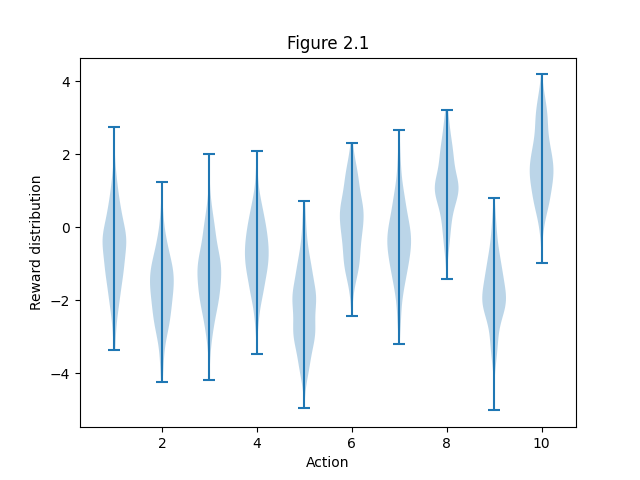
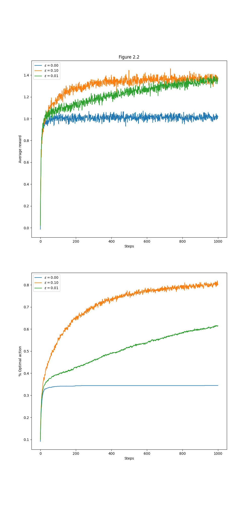
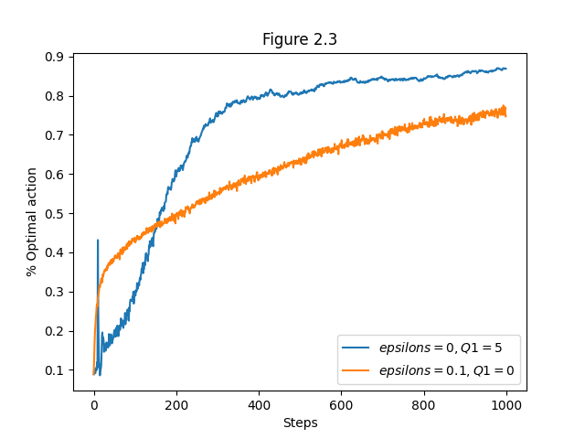
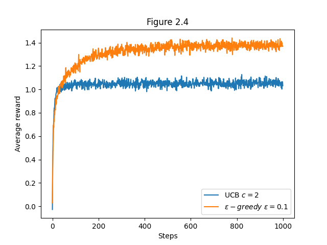
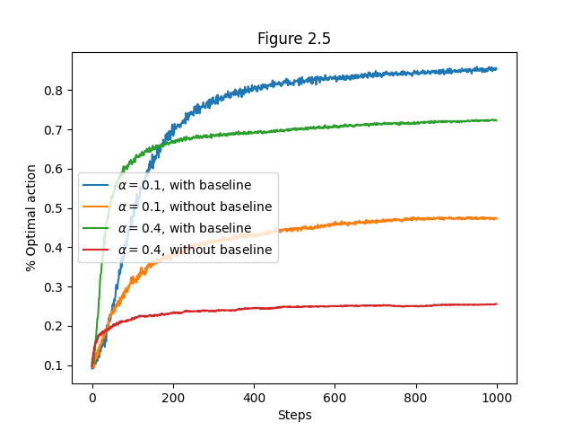
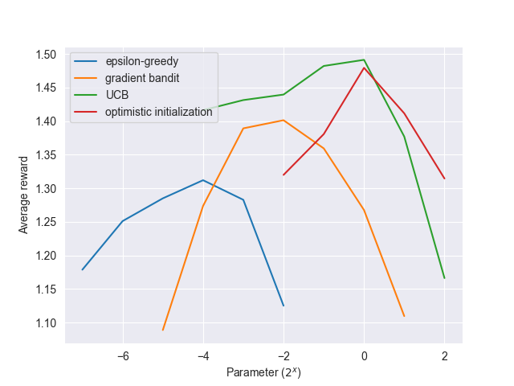

# 10-Armed Bandit 
This repository contains an implementation of the **10-armed bandit testbed**, inspired by Chapter 2 of the classic book *Reinforcement Learning: An Introduction* by Richard S. Sutton and Andrew G. Barto. The simulation compares various action-selection strategies in multi-armed bandit problems through empirical analysis and visualization.

##  Background

The **k-armed bandit problem** is a fundamental reinforcement learning scenario used to study the exploration-exploitation tradeoff. This notebook investigates and visualizes the average performance of different bandit algorithms across multiple runs and time steps.

All plots correspond to figures from **Chapter 2** of the book and reproduce experiments shown in Figures 2.1 to 2.6.

---

## Structure

* `bandit.py`: Implementation of the Bandit class with support for:

  * ε-greedy action selection
  * Optimistic initialization
  * Upper-Confidence Bound (UCB)
  * Gradient bandit algorithms
* `notebooks` (this file): Simulation logic, experimental setup, and plotting.
* `generated_images`: Directory where result plots are saved.

---

## Simulation Overview

In this simulation:

* Each **bandit** has 10 arms, with action values drawn from a normal distribution.
* We perform **2000 independent runs**, each for **1000 time steps**, and average the results.
* We evaluate strategies based on:

  * Average reward over time
  * Percentage of times the optimal action is chosen

---

##  Figures & Their Meanings

###  Figure 2.1 — Reward Distributions

This violin plot shows the **true reward distributions** of the 10 actions (arms).
Each action's reward is sampled from a normal distribution with its own mean, visualizing the stochastic nature of each arm.
**Purpose**: To illustrate that the agent must learn which actions are best based on noisy observations.

---

### Figure 2.2 — Greedy vs ε-Greedy

This figure compares three ε-greedy strategies:

* **ε = 0**: Purely greedy
* **ε = 0.1**
* **ε = 0.01**

**Top plot**: Average reward over time
**Bottom plot**: % of optimal action chosen

**Purpose**: Demonstrates how ε-greedy methods balance exploration and exploitation. Pure greedy gets stuck in suboptimal actions, while ε > 0 explores and eventually performs better.

---

### Figure 2.3 — Optimistic Initial Values

Compares two agents:

* **Optimistic initialization** (Q₁ = 5, ε = 0)
* **Realistic initialization** (Q₁ = 0, ε = 0.1)

**Purpose**: Shows how optimistic starting values can encourage exploration **without any randomness** (ε = 0), leading to eventual optimal behavior.

---

### Figure 2.4 — UCB vs ε-Greedy

Compares:

* **UCB (Upper Confidence Bound)**: with confidence level `c = 2`
* **ε-greedy**: with ε = 0.1

**Purpose**: Highlights how UCB selects actions more systematically by considering uncertainty (confidence), which can lead to better early learning performance than ε-greedy.

---

### Figure 2.5 — Gradient Bandit Algorithms

Compares **gradient bandit algorithms** with:

* Two learning rates: α = 0.1 and α = 0.4
* With and without **baseline** (average reward used to normalize updates)

**Purpose**: Shows that using a **baseline** improves performance and that **larger α** can speed up learning at the cost of higher variance.

---

### Figure 2.6 — Parameter Comparison of All Methods

Sweeps over different parameter values (powers of 2) for:

* **ε-greedy**
* **Gradient bandit**
* **UCB**
* **Optimistic initialization**

**Purpose**: Helps compare and tune each method by showing how **sensitive** performance is to its key parameter. Also offers a unified view of how each strategy performs under best and worst settings.

---

## Reference

Sutton, R. S., & Barto, A. G. (2018).
**Reinforcement Learning: An Introduction (2nd Ed.)**

[📘 Free PDF](http://incompleteideas.net/book/the-book.html)

---

##  Educational Objective

This project is for **educational use**, aimed at students learning reinforcement learning fundamentals. By visualizing behavior over time, the goal is to build **intuition about exploration**, **action value estimation**, and **strategy performance** in a simple yet rich environment.

