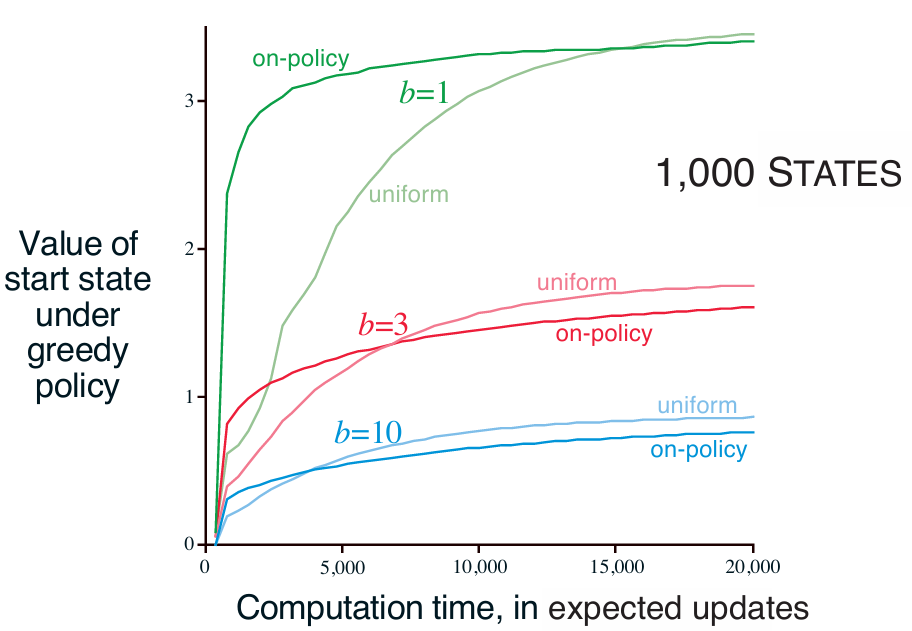

# Trajectory Sampling - One-Step Expected Updates

This experiment investigates how **sampling distribution** affects the efficiency of planning with **one-step expected updates** in large tabular MDPs. It reproduces the analysis from Sutton & Barto (*Reinforcement Learning: An Introduction*, Chapter 8, Figures 8.8.1 and 8.8.2).

---

## Background

We compare two sampling strategies for planning:

1. **Uniform Sampling**

   * Cycles through all state–action pairs equally.
   * Each update contributes equally to reducing value estimation error.
2. **On-Policy Sampling**

   * Follows the current greedy policy with an $\varepsilon$-greedy exploration probability of 0.1.
   * Updates are concentrated on state–action pairs actually visited under the policy.
   * Expected to **focus planning on relevant states**, which can accelerate initial learning.

All tasks are **episodic and undiscounted**, with the following characteristics:

* Number of states: (|S|) (1000 or 10,000 in experiments)
* Actions per state: 2
* Branching factor (b): 1, 3, or 10
* Transition to terminal state probability: 0.1
* Reward distribution: Gaussian, (\mu=0, \sigma=1)
* Maximum expected updates: 20,000
* Policy evaluation: Greedy with respect to current (Q)

---

## Learning Algorithms

### One-Step Expected Updates

For each state–action pair ((s, a)):

1. Retrieve **all possible successor states** (s') (given by the transition matrix) and their rewards.
2. Compute the **expected return**:

[
Q(s,a) \gets (1 - p_{\text{term}}) \cdot \text{mean}(R(s,a,s') + \max_{a'} Q(s',a'))
]

3. Repeat for each step according to the sampling strategy (uniform or on-policy).

---

### Evaluation

* Use **Monte Carlo evaluation** to compute the average return from the start state under the greedy policy given the current (Q)-values.
* Perform evaluation at fixed intervals during planning to track **performance over computation**.

---

## Simulation Overview

* **Tasks**: 200 randomly generated MDPs
* **States**: 1,000 and 10,000
* **Branching factors**: 1, 3, 10
* **Methods**: uniform_sampling, on_policy_sampling
* **Evaluation points**: 100 per task
* **Steps per task**: 20,000 expected updates
* **Runs**: Parallelized across CPU cores for efficiency

---

## Results

### Effect of Branching Factor on 1,000-State Tasks



* On-policy sampling accelerates planning early, especially for **smaller branching factors**.
* Uniform sampling provides slower initial gains but catches up in the long run.
* The initial advantage of on-policy sampling diminishes as more updates are applied.

---

### Effect of Number of States on Branching Factor 1


* For larger state spaces (10,000 states), **on-policy sampling retains its advantage for longer**.
* Concentrating updates on relevant states yields **large and sustained performance improvements**.
* Uniform updates eventually catch up but require significantly more computation.

---

### Plot from Simulation

The following figure reproduces the simulation results for all combinations of states, branching factors, and sampling strategies:

```python
plt.figure(figsize=(12, 16))
# Loop over number of states and branch factors
# Plot mean value of start state under greedy policy
```

 (see page 174)

Observations:

* **Smaller branching factors** benefit most from on-policy focus.
* **Large state spaces** make uniform updates expensive and slow.
* **On-policy sampling** is effective for rapid improvement in high-dimensional MDPs, especially early in planning.

---

## Key Takeaways

* **Sampling distribution matters**: focusing updates on frequently visited states accelerates learning.
* **Branching factor moderates the effect**: larger branching factors reduce the relative benefit of on-policy sampling.
* **State-space size amplifies differences**: larger MDPs make uniform updates less practical.
* Planning strategies should **balance computation and policy relevance** to optimize efficiency in large tabular problems.

---

## Reference

* Sutton, R. S., & Barto, A. G. (2018). *Reinforcement Learning: An Introduction (2nd ed.)*

  * Chapter 8: Planning and Learning with Tabular Methods, Figures 8.8.1–8.8.2

---

This setup complements the previous **expected vs. sample updates** experiment by illustrating **how the distribution of updates affects planning speed and efficiency**.
