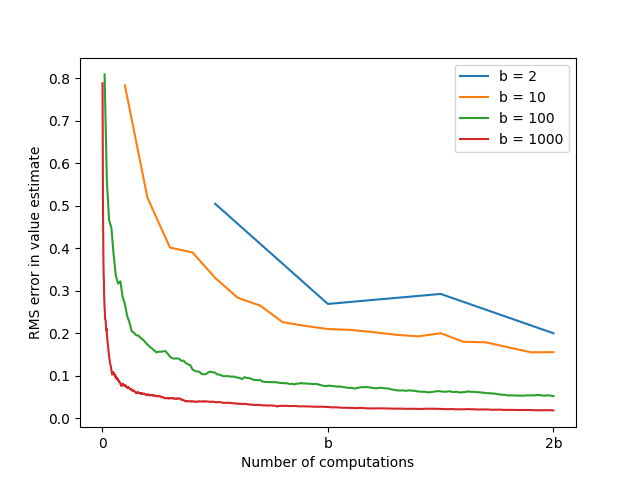

# Expected vs. Sample Updates - Estimation Error Analysis

This project empirically analyzes the tradeoff between **expected updates** and **sample updates** in **value estimation** for reinforcement learning. It reproduces the findings from Sutton & Barto’s *Reinforcement Learning: An Introduction* (Chapter 8, Figure 8.7).

---

## Background

In TD and Monte Carlo learning, updating a value estimate for a **state–action pair** ((s, a)) can be done in two ways:

1. **Expected update**:

   * Uses all possible next states (s') and their probabilities (p(s'|s,a))
   * Reduces sampling error
   * Computational cost scales with the **branching factor** (b) (number of possible next states)

2. **Sample update**:

   * Uses a single next state (s') sampled according to (p(s'|s,a))
   * Computationally cheaper
   * Reduces error gradually, with variance decreasing as more samples are taken

The central question:

*Given a unit of computational effort, is it better devoted to a few expected updates or to (b) times as many sample updates?*

---

## Structure

* `src/expectation_vs_sample.py`

  * Implements the `calculate_errors` function
  * Simulates the reduction in **estimation error** for sample updates as a function of the number of updates and branching factor

* `notebooks/expectation_vs_sample.ipynb`

  * Runs experiments for various branching factors (b)
  * Tracks RMS error in value estimates over multiple runs
  * Plots the results (reproducing Figure 8.7)

* `book_images/Figure_8_7.PNG`

  * Original figure from the textbook

* `generated_images/figure_8_7.png`

  * Plot generated from the notebook simulation

* `README.md`

  * This file

---

## Learning Algorithms

The **learning algorithm** used in this experiment is **sample averaging**, which updates value estimates based on a sequence of sampled successor states:

1. **Initialization**:

   * Set the initial estimate of the current state to any value (true values assumed for successors in this simulation).

2. **Sample Update**:

   * Randomly select one of the (b) successor states.
   * Append its value to the list of observed samples.
   * Update the estimate as the **mean of all observed samples** so far.

3. **Error Calculation**:

   * After each sample, compute the **absolute difference** between the estimated value and the true value.
   * Repeat for (2 \times b) sample updates.

This approach mimics **incremental learning** in large-scale MDPs where full expected updates are computationally expensive.

---

## Simulation Overview

* **Runs**: 100 independent trials
* **Branching factors**: 2, 10, 100, 1000
* **Sample updates per run**: (2 \times b)

For each trial:

1. The true value of the current state is set as the mean of the values of its successor states.
2. Sample updates are performed by **randomly picking one successor state** and updating the estimate with its value.
3. **RMS error** is tracked after each update.
4. Errors are averaged over all runs for each branching factor.

---

## Results

### Estimation Error vs. Computation (Reproduction of Figure 8.7)

Observations:

* For **small branching factors** (e.g., (b = 2)), each sample update contributes a small fraction to reducing error; expected updates are more efficient.
* For **moderate to large branching factors** (e.g., (b = 10, 100, 1000)), **the first few sample updates reduce RMS error dramatically**, achieving most of the benefit of an expected update with only a fraction of the computation.
* Even though an expected update is ideal (reduces error to 0), a few sample updates applied to **many state–action pairs** can achieve similar improvement much faster.
* Sample updates are particularly advantageous in **large-scale problems**, where expected updates are computationally expensive.

---

## Reference

* Sutton, R. S., & Barto, A. G. (2018). *Reinforcement Learning: An Introduction (2nd ed.)*

  * [Chapter 8 – Planning and Learning with Tabular Methods](http://incompleteideas.net/book/RLbook2020.pdf#page=200) (see page 166)
---

## Educational Objective

This experiment illustrates:

* The **tradeoff between expected and sample updates** in value estimation
* How **computational efficiency** affects the choice of update method
* Why **sample updates** are often preferred in large MDPs
* How the **branching factor** impacts the rate at which estimation error decreases

This example highlights practical considerations for implementing **model-based vs. model-free updates** in reinforcement learning.
