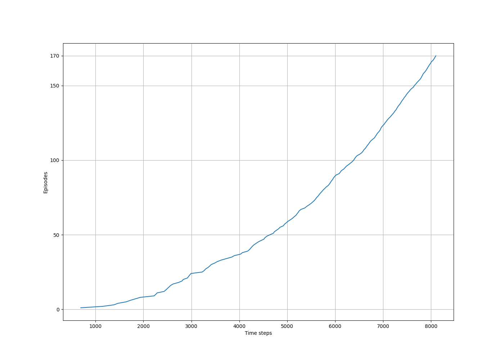

# Windy Gridworld – SARSA 

## Background

This implementation demonstrates **on-policy TD control using SARSA** in the **Windy Gridworld** environment, as described in Example 6.5 of Sutton & Barto’s *Reinforcement Learning: An Introduction* (2nd edition).

The agent learns to reach a goal state in a gridworld environment affected by vertical wind in certain columns. The goal is to minimize the number of time steps per episode by learning an optimal policy.

## Environment Structure

* **Gridworld layout**: Rectangular grid with a **start state (S)** and a **goal state (G)**.
* **Actions**: Up, Down, Left, Right.
* **Wind**:

  * Certain columns have wind blowing **upward**, pushing the agent 1–2 cells up after an action.
  * Wind strength varies by column and is provided as an array (see below).
* **Transition Dynamics**:

  * Action effects are deterministic but wind modifies the outcome.
  * Episode ends when the goal state is reached.
* **Reward**: Constant reward of **-1** at each time step until the goal is reached.
* **Discount Factor**: γ = 1 (undiscounted).

## Simulation Overview

* **Algorithm**: ε-greedy **SARSA** (on-policy TD control).
* **Exploration**: ε = 0.1.
* **Learning rate**: α = 0.5.
* **Initialization**: Q(s, a) = 0 for all state-action pairs.
* **Termination**: After a fixed number of episodes (170).
* **Tracking**: Cumulative number of time steps taken to complete episodes.

## Code Structure

* `world`: Dictionary defining grid dimensions.
* `actions`: Encoded action mapping for up/down/left/right.
* `wind`: List of wind strength per column.
* `play()`: Runs one SARSA episode with ε-greedy exploration.
* Action-value function `Q(s, a)` is updated in-place.

## Figures and Interpretation

### `example_6_5.png` – Episodes vs Time Steps



* **X-axis**: Time steps (cumulative)
* **Y-axis**: Episode number
* The **steep slope** indicates **faster goal reaching** as learning progresses.
* After around 8000 steps, the **optimal policy** is mostly found.
* Continued ε-greedy exploration results in slightly longer average episode lengths (\~17 vs minimum 15).

### Optimal Policy Table

After training, the optimal action for each cell is shown below (arrows denote the best action from that cell):

```
Optimal policy is:
['→', '→', '→', '→', '→', '→', '→', '→', '→', '↓']
['↑', '↑', '↑', '↑', '↑', '↑', '↑', '↑', '↑', '↓']
['↑', '↑', '↑', '↑', '↑', '↑', '↑', '↑', '↑', '↓']
['→', '→', '→', '→', '→', '→', '→', '→', '→', 'G']
['→', '→', '→', '→', '→', '→', '→', '→', '→', '↑']
['→', '→', '→', '→', '→', '→', '→', '→', '→', '↑']
['→', '→', '→', '→', '→', '→', '→', '→', '→', '↑']
```

### Wind Strength per Column

```
Wind strength for each column:
['0', '0', '0', '1', '1', '1', '2', '2', '1', '0']
```

## Reference

* Sutton, R. S., & Barto, A. G. (2018). *Reinforcement Learning: An Introduction* (2nd ed.).
 
  * [Example 6.5 – Windy Gridworld](http://incompleteideas.net/book/RLbook2020.pdf#page=97)  (see page 130).

## Educational Objective

This experiment illustrates how **SARSA**, as an **on-policy temporal-difference control algorithm**, effectively learns an optimal policy in a **stochastic dynamic environment** like Windy Gridworld, where deterministic policies may get stuck or take longer due to environment dynamics like wind.